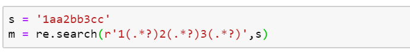

# json文件读写

#### 读

```python
with open("C:\\Users\\daiyifan\\pclady_wiki\\pclady_wiki\\answers1.json",
        "r",
        encoding="utf-8") as js1:
    url1=json.load(js1)
```

#### 写

```python
with open("C:\\Users\\daiyifan\\pclady_wiki\\pclady_wiki\\answers.json","w",encoding="utf-8") as js3:
    json.dump(url_sum,js3)#只能写入字典
    f.write('\n')#可以换行
```

#### replace

经过replace的字符串不改变本身的值，而作为值返回。

```python
str=str.repalce(old,new[,max])#max指最多匹配次数
```

#### 正则表达式

re模块正则表达式匹配的结果会返回为一个对象，可以通过`group`方法来查看该对象的值。`group(0)`为全部匹配的值，`group(1)`为第一次匹配（）中的值如：




 re模块的`sub`的替换结果可以用函数表示

详见[re.sub使用替换函数](../../mouka/python/python-tricks/re_sub_function.md)


